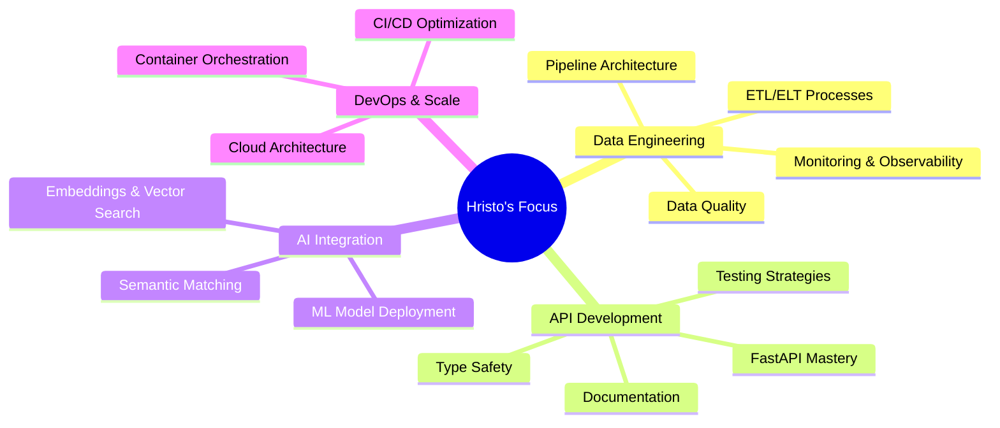

#  Hi there, I'm Hristo Bonev!

<div align="center">
  
</div>

<div align="center">
  
  [](https://hristobonev.com)
  [](https://linkedin.com/in/hristo-bonev)
  [](mailto:chkbonev@gmail.com)
  
  
  
</div>

---

## 🚀 About Me


```python
class HristoBonev:
    def __init__(self):
        self.role = "Junior Software & Data Engineer"
        self.location = ["Sofia", "London"]
        self.background = "Creative → Tech"
        self.passion = ["Data Pipelines", "API Design", "DevOps"]
        self.current_focus = "Building reliable, tested systems"
        
    def get_skills(self):
        return {
            "languages": ["Python", "SQL", "JavaScript", "HTML/CSS"],
            "frameworks": ["FastAPI", "SQLModel", "Pydantic"],
            "databases": ["PostgreSQL", "Supabase", "SQLite"],
            "tools": ["Docker", "Git", "Azure", "AWS"],
            "interests": ["AI/ML", "Data Engineering", "System Design"]
        }
        
    def current_mission(self):
        return "Turning ideas into useful, well-tested systems 🎯"
```

---

## 💼 Currently @ EDITED

<div align="center">
  
</div>

🔧 **Building automated data ingestion pipelines**  
📊 **Ensuring data quality, reliability & performance at scale**  
⚡ **Improving system observability and monitoring**

---

## 🛠️ Tech Arsenal

<details>
<summary><b>🐍 Backend & Data</b></summary>
<br>


</details>

<details>
<summary><b>🗄️ Databases & Storage</b></summary>
<br>


</details>

<details>
<summary><b>🚀 DevOps & Deployment</b></summary>
<br>


</details>

<details>
<summary><b>🤖 AI & ML Tools</b></summary>
<br>


</details>

<details>
<summary><b>🌐 Frontend & Web</b></summary>
<br>


</details>

---

## 🎯 Featured Projects

<div align="center">

### 🔗 [BetweenJobs](https://github.com/yourusername/betweenjobs) - AI-Powered Job Matching
*FastAPI • SQLModel • Supabase • OpenAI Embeddings*

[](https://github.com/yourusername/betweenjobs)

**🔥 Key Features:**
- 🤖 **AI-powered matching** using cosine similarity with OpenAI embeddings
- 🔐 **JWT authentication** & secure user management
- 📧 **Automated notifications** via Mailjet
- 🐳 **Dockerized deployment** with Azure CI/CD
- ✅ **Comprehensive unit testing**

---

### 🌐 [Personal Portfolio](https://hristobonev.com) - Dynamic Web Presence
*FastAPI • Jinja2 • AWS S3 • SendGrid*

[](https://github.com/yourusername/portfolio)

**🔥 Key Features:**
- 📱 **Responsive design** across all devices
- 📬 **Smart contact form** with SendGrid integration
- ☁️ **AWS S3** for optimized media delivery
- 🚀 **Heroku deployment** with continuous delivery

---

### 💬 [The Forum](https://github.com/yourusername/forum) - Modern Discussion Platform
*FastAPI • JWT Auth • RESTful API*

[](https://github.com/yourusername/forum)

**🔥 Key Features:**
- 🔍 **Advanced search** & pagination
- 🔒 **Secure authentication** system
- 📊 **RESTful API** design
- 🧪 **Comprehensive testing** suite

</div>

---

## 📊 GitHub Analytics

<div align="center">


</div>

<div align="center">
  
</div>

<div align="center">
  
</div>

---

## 🎯 Current Focus Areas

<div align="center">



</div>

---

## 🏆 GitHub Trophies

<div align="center">
  
</div>

---

## 🎭 Beyond the Code

<div align="center">

| 🎬 **Former Life** | 🎺 **Music** | 🤸 **Active** | 🌍 **Location** |
|:--:|:--:|:--:|:--:|
| Actor & Stunt Performer | Trumpet Player | Sports Enthusiast | Sofia ↔ London |

</div>

<div align="center">

*"From stage to code – I bring creativity, precision, and performance to everything I build"*

</div>

---

## 🤝 Let's Connect & Collaborate

<div align="center">

<a href="mailto:chkbonev@gmail.com">
  
</a>
<a href="https://linkedin.com/in/hristo-bonev">
  
</a>
<a href="https://hristobonev.com">
  
</a>

</div>

---

<div align="center">
  
  ### 💡 *"Turning ideas into reliable, well-tested systems—one commit at a time."*
  
  
  
</div>
