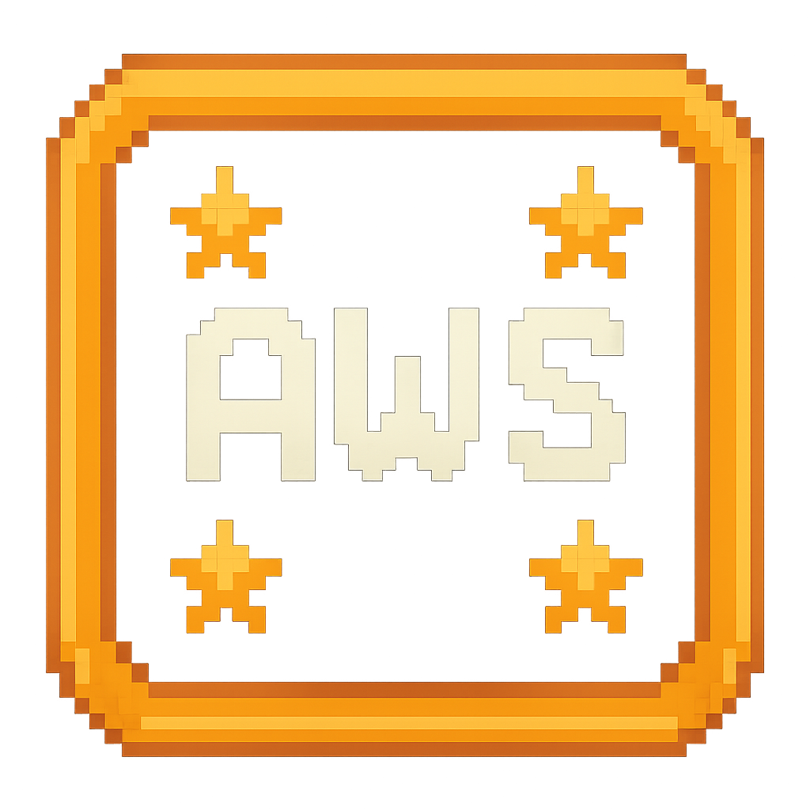
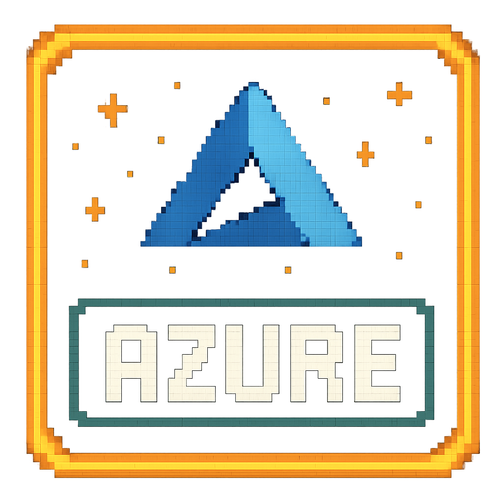
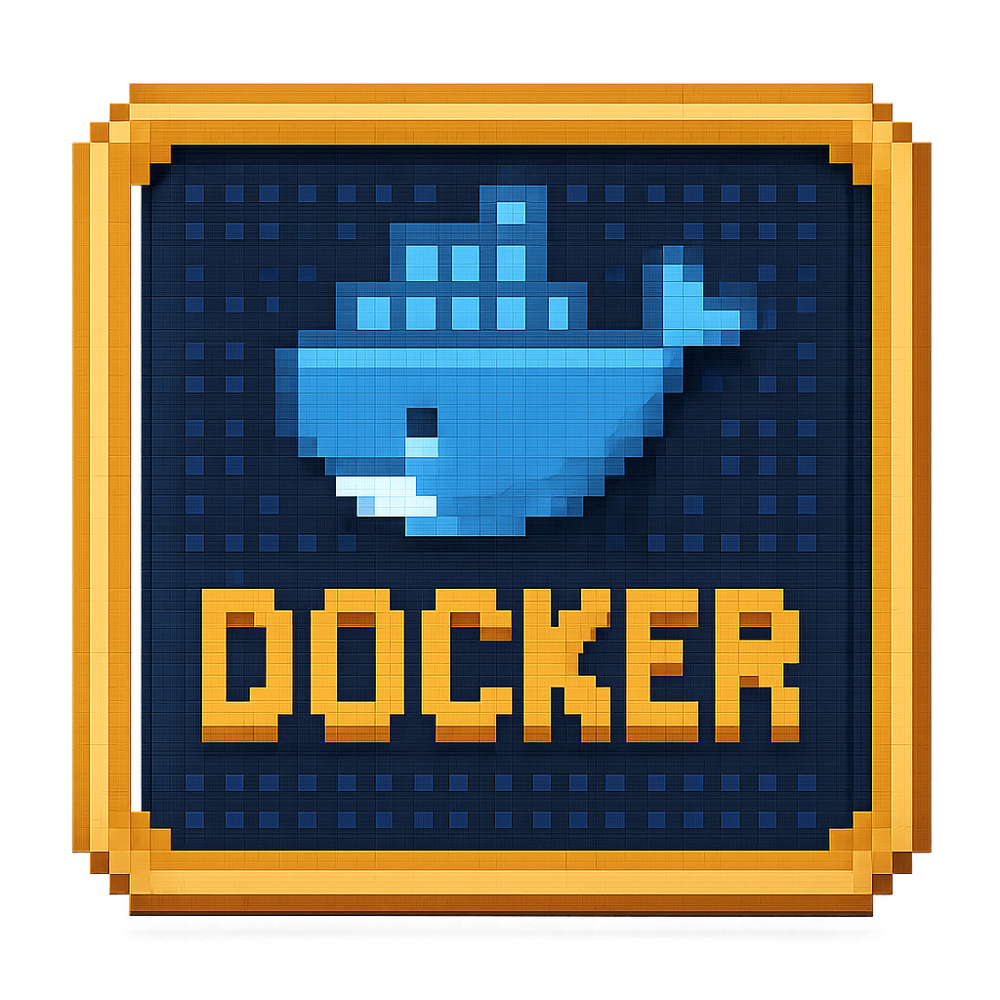
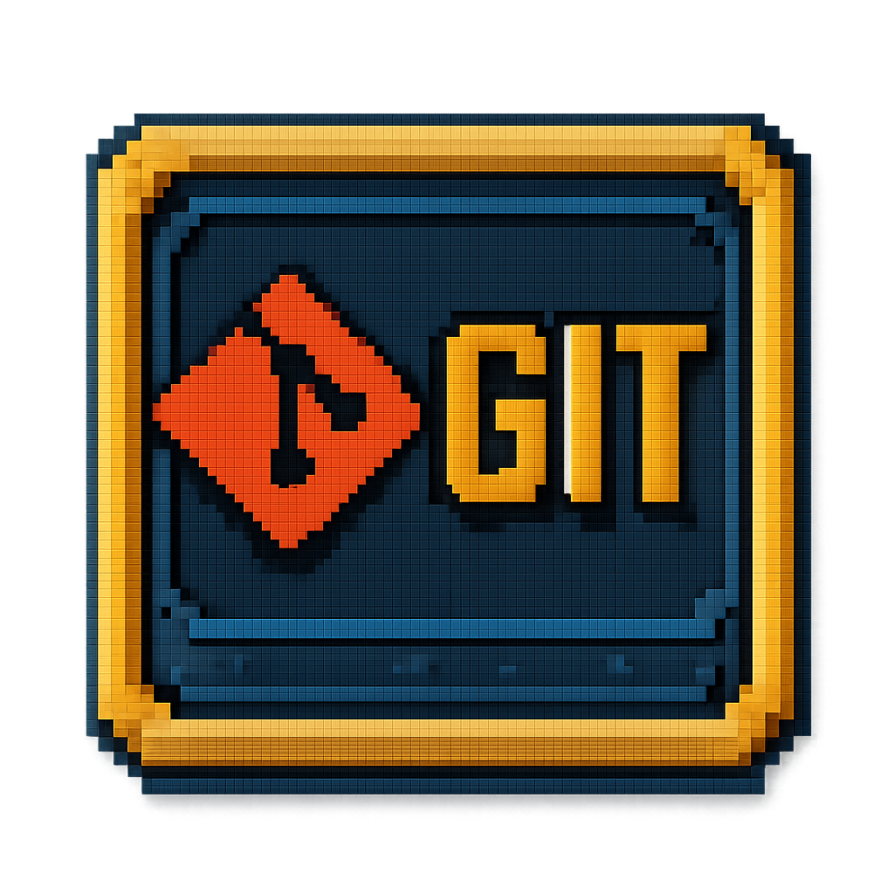
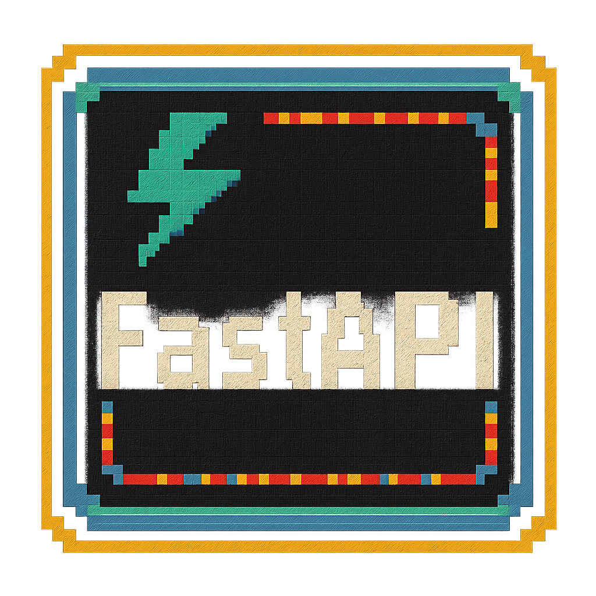
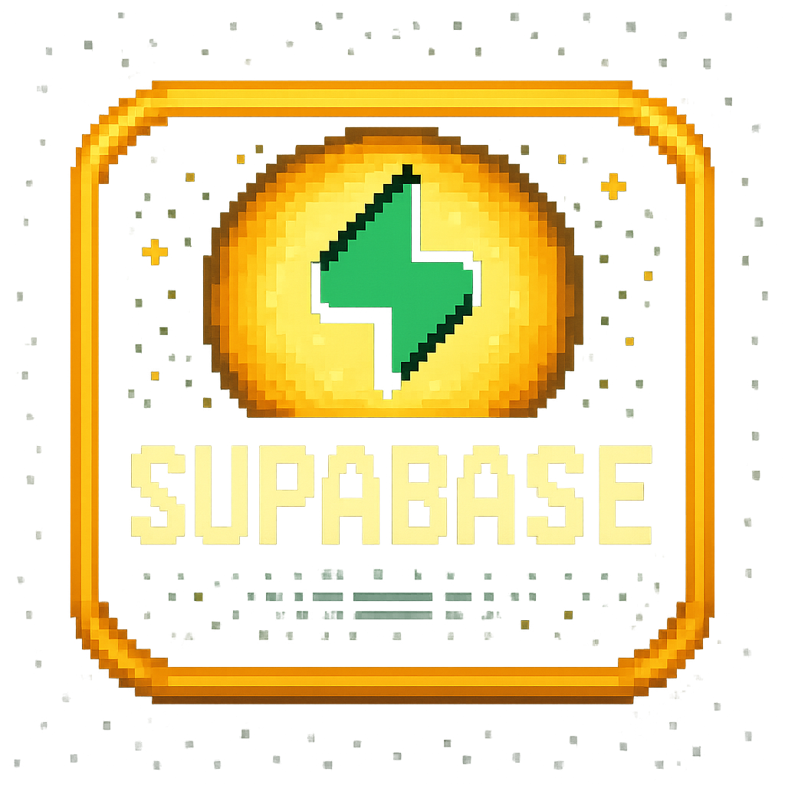
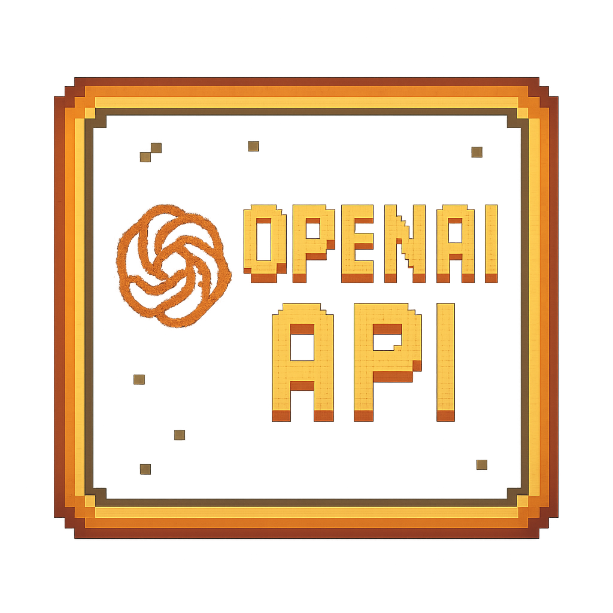

<div align="center">
<pre>
██╗  ██╗██████╗ ██╗███████╗████████╗ ██████╗
 ██║  ██║██╔══██╗██║██╔════╝╚══██╔══╝██╔═══██╗
 ███████║██████╔╝██║███████╗   ██║   ██║   ██║
 ██╔══██║██╔══██╗██║╚════██║   ██║   ██║   ██║
  ██║  ██║██║  ██║██║███████║   ██║   ╚██████╔╝ 
╚═╝  ╚═╝╚═╝  ╚═╝╚═╝╚══════╝   ╚═╝    ╚═════╝
</pre>
</div>

```python
class Me:
    def __init__(self):
        self.role = "Junior Software & Data Engineer"
        self.location = ["Sofia", "London"]
        self.background = "Creative → Tech"
        self.passion = ["AI/ML/Data Engineering", "Backend and API Design", "DevOps"]
        self.current_focus = "Building reliable data systems"
        self.vision = "Transitioning into AI/ML engineering"
        
    @property
    def skills(self):
        return {
            "languages": ["Python", "SQL", "JavaScript", "HTML/CSS"],
            "frameworks": ["FastAPI", "Scrapy", "Playwright"],
            "databases": ["PostgreSQL", "Supabase", "MariaDB"],
            "tools": ["Docker", "Git", "Azure", "AWS"],
        }
        
    def current_mission(self):
        return "Turning ideas into useful, well-tested systems 🎯"
```

<div align="center">
<pre>
    
  ```ascii
╔══════════════════════════════════════════════════════════════╗╔══════════════════════════════════════════════════════════════╗
║ 🏢 WORK @ EDITED                                             ║║ 🏠 HOME                                                     ║
║ ┌────────────────────────────────────────────────────────┐   ║║ ┌────────────────────────────────────────────────────────┐   ║
║ │ 🚀 Junior Data Ingestion Engineer                      │   ║║ │ 🎬 Former Actor and Stunt performer                   │   ║
║ │ ⚡ Building automated data ingestion pipelines         │   ║║ │ 🤸 Sport and arts junkie                              │   ║
║ │ 📊 Ensuring data quality & performance at scale        │   ║║ │ 🎤 Launching my stand-up comedy soon                  │   ║
║ │ 🔍 Improving system observability & monitoring         │   ║║ │ 🃏 Wildcard in Every Room                             │   ║
║ └────────────────────────────────────────────────────────┘   ║║ └────────────────────────────────────────────────────────┘   ║
╚══════════════════════════════════════════════════════════════╝╚══════════════════════════════════════════════════════════════╝

  ```
</pre>
</div>

<div align="center">
<pre>
┌─────────────────────────────────┐
│ >> [ ACHIEVEMENTS UNLOCKED ] << │
└─────────────────────────────────┘
</pre>
</div>
 

<p align="left">
  <a href="https://aws.amazon.com/" target="_blank">
    
  </a>
  <a href="https://azure.microsoft.com/" target="_blank">
    
  </a>
  <a href="https://www.heroku.com/" target="_blank">
    
  </a>
  <a href="https://www.docker.com/" target="_blank">
    
  </a>
  <a href="https://git-scm.com/" target="_blank">
    
  </a>
  
</p>

<p align="left">
  <a href="https://www.python.org/" target="_blank">
    
  </a>
  <a href="https://fastapi.tiangolo.com/" target="_blank">
    
  </a>
  <a href="https://flask.palletsprojects.com/" target="_blank">
    
  </a>
  
</p>

<p align="left">
  <a href="https://www.mysql.com/" target="_blank">
    
  </a>
  <a href="https://mariadb.org/" target="_blank">
    
  </a>
  <a href="https://www.postgresql.org/" target="_blank">
    
  </a>
  <a href="https://www.sqlite.org/" target="_blank">
    
  </a>
  <a href="https://supabase.com/" target="_blank">
    
  </a>
  
</p>

<p align="left">
  <a href="https://developer.mozilla.org/en-US/docs/Web/HTML" target="_blank">
    
  </a>
  <a href="https://developer.mozilla.org/en-US/docs/Web/CSS" target="_blank">
    
  </a>
  <a href="https://developer.mozilla.org/en-US/docs/Web/JavaScript" target="_blank">
    
  </a>
  <a href="https://www.json.org/json-en.html" target="_blank">
    
  </a>
  
</p>

<p align="left">
  <a href="https://playwright.dev/" target="_blank">
    
  </a>
  <a href="https://scrapy.org/" target="_blank">
    
  </a>
  
</p>

<p align="left">
  <a href="https://grafana.com/" target="_blank">
    
  </a>
  <a href="https://www.postman.com/" target="_blank">
    
  </a>
  
</p>

<p align="left">
  <a href="https://huggingface.co/" target="_blank">
    
  </a>
  <a href="https://platform.openai.com/docs/" target="_blank">
    
  </a>
  
</p>


 
<div align="center">
<pre>
┌───────────────────────────┐
│ >> [ PLAYER STATS ] << │
└───────────────────────────┘
</pre>
</div>

<div align="center">

</div>

<div align="center">

</div>

<div align="center">
  
</div>

<div align="center">
<pre>
┌─────────────────────────────┐
│ >> ✉[ LET'S CONNECT ]✉ << │
└─────────────────────────────┘
</pre>
</div>

<div align="center">

  <a href="mailto:chkbonev@gmail.com">
    
  </a>
  <a href="https://linkedin.com/in/hristo-bonev">
    
  </a>
  <a href="https://www.hristobonev.com">
    
  </a>

</div>


</div>


